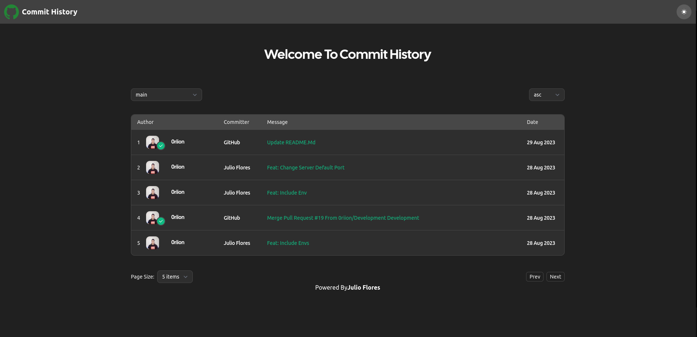
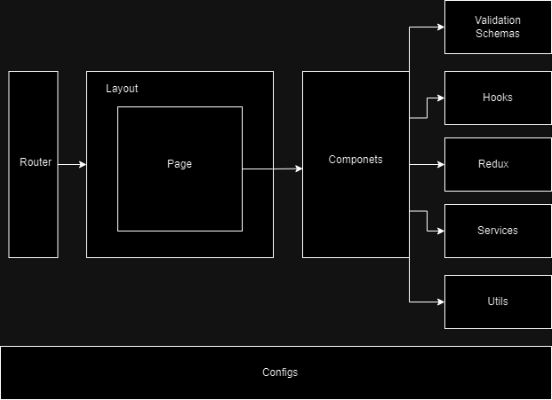

# Commit Flow History

This project lists all commits of a project. It provides the following functionalities:

- List all commits and show in a table
- Paginate all the commits of the project by the user, with 1, 5, 10, or 20 items per page.
- Order the commits from a page for the newest and oldest commits.
- Change branch and list all commits based on the branch.



## Technologies

The technologies used in this project are:

- Next.js
- NestJS
- Tailwind CSS
- Monorepo with pnpm workspace
- tRPC
- TypeScript
- Redux
- Redux Toolkit
- Next Theme

## Requirements

Both the server and the client need the following environment variables:

- `server`:
    - `PORT`: the port where the server will run.

- `client`:
    - `NEXT_PUBLIC_ENVIRONMENT`: the environment where the application is running, it can be `development`, `staging`, or `production`.
    - `NEXT_PUBLIC_API_URL`: the URL of the server API.
    - `NEXT_PUBLIC_REPO_OWNER=0riion`: the owner of the repository.
    - `NEXT_PUBLIC_REPO_NAME`: the name of the repository.

## How to use the application

### Using pnpm

This project uses pnpm as package manager, so you need to install it to run the application:

- Nodejs installed, i recommend to use a version greater than 14.

- Install pnpm: once you have nodejs installed, you can install pnpm with the following command:

```bash
npm i -g pnpm
```

- Clone the repository: clone the repository with the following command:

```bash
git clone <repository-url>
```

- Install dependencies: once you clone the repository, you need to install the dependencies with the following command:

```bash
pnpm i
```

- Run the application: once you install the dependencies, you can run the application with the following command:

```bash
pnpm dev
```

- Run tests: once you install the dependencies, you can run the tests with the following command:

```bash
pnpm test
```

### Using docker

This project has a docker-compose file, so you can run the application with docker-compose:

- Clone the repository: clone the repository with the following command:

```bash
git clone <repository-url>
```

- Run the application: once you clone the repository, you can run the application with the following command:

```bash
docker-compose up
```

## Project Structure

The server and client are in the same repository, the server is in the `apps/server` folder and the client is in the `apps/client` folder. Thanks you can install, remove, and update the dependencies of the server and client independently.

- `theme`: a simple theme created with Next Theme was used to manage the colors of the application, and refactor the styles of the application.
- `dark-light mode`: the application has a dark and light mode, the mode is saved internally.

### Client Structure



- `Router`: the router of the application, it is based on the Next.js router.
- `Components`: the components of the application, this components are used in the pages.
- `Hooks`: the hooks of the application.
- `Redux`: manage the state of the application, the state it's simple, so it's not necessary to use Redux, but it was used to show some knowledge of Redux.
- `Services`: The services are functions that are used to make requests to the server integrated with tRPC.
- `Styles`: The styles contain the global styles of the application, part of the simple theem created.
- `Utils`: the utils of the application.

### Server Structure

The server is a NestJS application, the structure default of a NestJS application was used. The only difference is that RTPC was integrated to make the requests to the GitHub API and safe the API.

The api is not connected to a database, because it is not necessary for this exercise, instead of that it is integrated with the github api.
